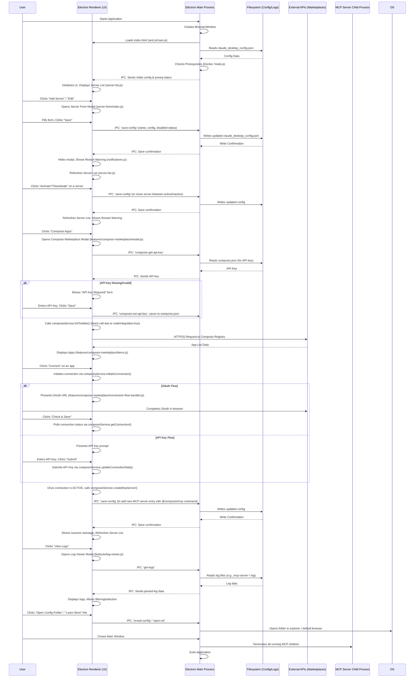
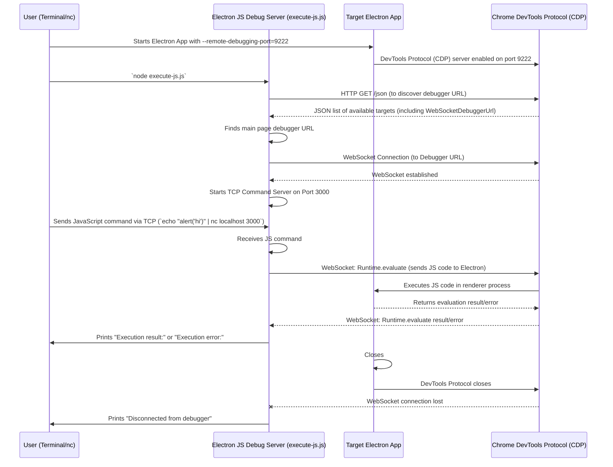

COMPREHENSIVE DOCUMENTATION 

## Table of Contents

1.  [Project Overview](#project-overview)
2.  [Core Concepts](#core-concepts)
3.  [Architecture](#architecture)
    *   [High-Level Overview](#high-level-overview)
    *   [Mermaid Sequence Diagram: Core Application Flow](#mermaid-sequence-diagram-core-application-flow)
    *   [Mermaid Sequence Diagram: Electron Debug Server](#mermaid-sequence-diagram-electron-debug-server)
4.  [Code Structure and Navigation](#code-structure-and-navigation)
    *   [Root Directory](#root-directory)
    *   [CSS Directory (`css/`)](#css-directory-css)
    *   [HTML Directory (`html/`)](#html-directory-html)
    *   [JavaScript Directory (`js/`)](#javascript-directory-js)
    *   [Electron Debugger (`electron-debugger/`)](#electron-debugger-electron-debugger)
    *   [Testing Directories (`tests/`, `playwright-report/`, `test-results/`)](#testing-directories-tests-playwright-report-test-results)
5.  [Key Features and Their Implementations](#key-features-and-their-implementations)
    *   [MCP Server Management](#mcp-server-management)
    *   [Quick Add MCP Servers](#quick-add-mcp-servers)
    *   [Marketplaces Integration](#marketplaces-integration)
        *   [General Marketplace Structure](#general-marketplace-structure)
        *   [Local Marketplace](#local-marketplace)
        *   [Composio Apps Marketplace](#composio-apps-marketplace)
        *   [Apify Actors Marketplace](#apify-actors-marketplace)
        *   [Smithery Registry](#smithery-registry)
    *   [Log Viewer](#log-viewer)
    *   [JSON Configuration Editor](#json-configuration-editor)
    *   [Import Server from URL/Paste](#import-server-from-urlpaste)
    *   [Prerequisites & About](#prerequisites--about)
    *   [Electron Debugger (External Tool)](#electron-debugger-external-tool)
6.  [Setting Up and Running the Project](#setting-up-and-running-the-project)
    *   [Prerequisites](#prerequisites)
    *   [Installation](#installation)
    *   [Running the Application](#running-the-application)
    *   [Configuration File Location](#configuration-file-location)
7.  [Testing](#testing)
    *   [Running Tests](#running-tests)
8.  [Build and Release Process](#build-and-release-process)
    *   [Obfuscation](#obfuscation)
9.  [Guidance for New Contributors](#guidance-for-new-contributors)
    *   [Where to Start](#where-to-start)
    *   [Coding Constitution (Mandatory Rules)](#coding-constitution-mandatory-rules)
    *   [Important Lessons Learned](#important-lessons-learned)

---

## 1. Project Overview

**Project Name:** MCP Studio

**Purpose:** MCP Studio is an Electron-based desktop application designed to simplify the management and interaction with Model Context Protocol (MCP) servers. It provides a user-friendly interface to configure, start, stop, and discover various MCP servers, enabling seamless integration of diverse functionalities (e.g., file system access, AI tools, API integrations) into applications like Claude.

**Key Functionality:**
*   **Server Management:** Add, edit, delete, activate, and deactivate MCP server configurations.
*   **Quick Add:** Facilitate rapid setup of pre-configured MCP servers using templates.
*   **Marketplaces:** Discover and integrate external MCP servers and tools from platforms like Composio, Apify, and Smithery.
*   **Log Viewer:** Monitor real-time logs from running MCP servers for debugging and oversight.
*   **Configuration Management:** Edit the entire `claude_desktop_config.json` file in a JSON editor, or import server configurations from URLs and clipboard.
*   **Prerequisite Checks:** Inform users about missing dependencies like Docker or Node.js.

**Target Audience:** Developers, AI agent users, and anyone needing to manage local or remote MCP server instances.

---

## 2. Core Concepts

*   **MCP Server:** A program or service that exposes its capabilities (tools, actions, resources) via the Model Context Protocol. In MCP Studio, these can be:
    *   **Generic:** Any executable command.
    *   **NPX:** Node.js packages run via `npx` (e.g., `@modelcontextprotocol/server-filesystem`).
    *   **Docker:** Docker containers exposing MCP endpoints.
*   **`claude_desktop_config.json`:** The central configuration file for MCP Studio. It stores definitions for all active and inactive MCP servers, including their command, arguments, environment variables, and metadata. This file is typically located in platform-specific user data directories (e.g., `~/Library/Application Support/Claude/` on macOS).
*   **Server State:** Servers can be `active` (running or ready to run) or `inactive` (disabled, but their configuration is preserved).
*   **Marketplace Item:** A discoverable MCP server or app, usually exposed through a browsable marketplace. These items contain metadata like name, description, category, and often provide instructions or automated configurations for installation.

---

## 3. Architecture

### High-Level Overview

MCP Studio is an Electron application, which means it fundamentally consists of two main types of processes:

1.  **Main Process (`main.js` in root directory):** This is the Node.js environment that runs the core Electron application. It handles:
    *   Creating and managing browser windows (`BrowserWindow`).
    *   Accessing Node.js APIs (e.g., `fs`, `child_process`, `os`, `http/https`).
    *   Inter-Process Communication (IPC) with renderer processes.
    *   All file system operations (reading/writing `claude_desktop_config.json`, logs, marketplace data).
    *   Spawning and managing child processes for MCP servers (e.g., `npx` commands, Docker).
    *   Checking system prerequisites (Docker, Node.js).
    *   Interacting with external APIs (Apify, Composio, Smithery) for marketplace data.

2.  **Renderer Process (`js/main.js` loaded by `index.html`):** This is a Chromium browser environment responsible for rendering the user interface. It handles:
    *   All UI logic and user interactions.
    *   Displaying server lists, forms, modals, and marketplace content.
    *   Communicating with the main process via IPC for any operations requiring Node.js APIs or privileged access (e.g., saving config, opening external URLs, fetching marketplace data).
    *   *Note on `contextIsolation` and `nodeIntegration`*: As per `ELECTRON_INTEGRATION_NOTES.md`, for simplicity, this project explicitly sets `contextIsolation: false` and `nodeIntegration: true`. This allows the renderer process to **directly access Node.js APIs** (including `require`, `fs.promises`, `fetch`) and global Electron objects like `ipcRenderer` without a preload script. This simplifies development but is less secure for apps loading untrusted content.

3.  **IPC (Inter-Process Communication):** The bridge between the highly privileged main process and the potentially less secure renderer process. It allows the renderer to request actions from and receive data from the main process.

4.  **Child Processes:** MCP servers themselves are run as child processes managed by the main Electron process. Their console outputs are redirected to log files, which can then be viewed through the Log Viewer.

5.  **External APIs:** Marketplaces fetch data from external sources (Apify, Composio, Smithery registries) usually via `fetch` calls, which, due to `nodeIntegration: true`, can be initiated directly from the renderer process via internal modules.

### Mermaid Sequence Diagram: Core Application Flow

This diagram illustrates a typical user interaction flow, including server management and marketplace interactions.



### Mermaid Sequence Diagram: Electron Debug Server

This diagram explains the standalone Electron Debug Server located in `electron-debugger/`.



---

## 4. Code Structure and Navigation

The repository is organized into several key directories, making it easier to locate specific functionalities.

### Root Directory

*   `main.js`: **Electron Main Process Entry Point**. Handles app lifecycle, window creation, IPC communication, and Node.js-specific tasks like file I/O and process management.
*   `index.html`: **Main Renderer Process UI Entry Point**. The primary HTML file loaded into the Electron window, serving as the blueprint for the application's user interface.
*   `package.json`: Defines project metadata, scripts (`start`, `build`, `test`), and dependencies.
*   `preload.js`: (Empty Placeholder) Historically used for `contextIsolation` to expose Node.js APIs to the renderer. Currently empty due to `nodeIntegration: true` and `contextIsolation: false` for simplicity (`ELECTRON_INTEGRATION_NOTES.md`).
*   `.gitignore`, `.repomixignore`, `.clineignore`: Configuration files for Git and Repomix to ignore certain files.
*   `build-and-release.sh`, `obfuscate.js`, `makeicon.sh`: Scripts for building, obfuscating, and generating icons for the Electron application.
*   `CHANGELOG.md`, `CODE_OBFUSCATION.md`, `ELECTRON_INTEGRATION_NOTES.md`, `FLAG_STYLE_ARGS_README.md`, `LESSONS_LEARNED_1.md`, `LESSONS_LEARNED.md`, `LESSONS_LEARNED_COMPOSIO_INTEGRATION.md`, `REMOTE_DEBUGGING_GUIDE.md`, `APIFY_MARKETPLACE_INTEGRATION.md`, `composio-integration-workflow.md`, `smithery-integration-workflow.md`, `how-to-use-composio-service.md`, `marketplace.sample.json`, `smithery.sample.json`: Various documentation, READMEs, and sample files. These are critical for understanding specific features and past development decisions.

### CSS Directory (`css/`)

Contains all styling for the application, organized into global, component, and feature-specific stylesheets.
*   `main.css`: The primary stylesheet that imports all other CSS files.
*   `base.css`: Defines base CSS rules (body, typography, general elements).
*   `layout.css`: Manages the overall app layout (sidebar, main content, modals).
*   `responsive.css`: Contains media queries for responsive design.
*   `utilities.css`: Provides small, single-purpose utility classes (e.g., `d-none`, `text-center`).
*   `variables.css`: Defines CSS custom properties (variables) for the color palette, shadows, transitions, etc.
*   **`components/`**: Styles for reusable UI components.
    *   `badges.css`, `buttons.css`, `forms.css`, `modals.css`, `tables.css`.
*   **`features/`**: Stylesheets for specific application features.
    *   `quick-add.css`: Styling for the Quick Add modal.
    *   `log-viewer.css`: Styling for the log viewer modal.
    *   `directory.css`: Styles for directory and actor list input rows.
    *   **`marketplace/`**: Base styles for the general marketplace.
        *   `base.css`, `details.css`, `items.css`.
    *   **`composio-marketplace.css`**: Specific styles for Composio marketplace.
        *   Includes `composio-marketplace-buttons.css` for enhanced button styles and `composio-marketplace-details.css` (now empty, content moved to `marketplace/details.css`).
    *   **`apify-marketplace.css`**: Specific styles for Apify marketplace.
    *   **`smithery-marketplace/`**: Specific styles for Smithery marketplace.
        *   `base.css`, `details.css`, `forms.css`, `header.css`.
    *   **`server-list-enhancements/`**: Styles for the enhanced server list view.
        *   `controls.css`, `responsive.css`, `table.css`.

### HTML Directory (`html/`)

Contains HTML templates for various modal dialogs. These are loaded dynamically into `index.html` by `js/utils/modal-loader.js`.
*   `modals/`:
    *   `about-modal.html`
    *   `json-modal.html`
    *   `paste-modal.html`
    *   `quick-add-modal.html`
    *   `server-modal.html` (Add/Edit Server)

### JavaScript Directory (`js/`)

This is the core of the application's client-side logic (renderer process).
*   **`main.js`**: **Primary Renderer Process Entry Point**. This file is loaded by `index.html` and is responsible for initializing all other UI modules, setting up global event listeners, loading configuration, and generally coordinating the frontend application.
*   `renderer.js`: (Likely outdated/vestigial) Previously the main renderer entry. Its responsibilities have largely been moved to `js/main.js`.
*   `quick-add-templates.js`: Defines static JSON templates for the Quick Add feature.
*   **`config/`**:
    *   `config-manager.js`: **Central Configuration Handler**. A singleton class responsible for loading, saving, and manipulating the `claude_desktop_config.json` file. All server additions, updates, and deletions go through this module.
*   **`features/`**: Contains modularized code for specific features.
    *   **`apify-marketplace/`**: Logic for managing Apify marketplace integration.
        *   `connector.js`: Manages adding/removing Apify actors from the server config.
        *   `data.js`: Fetches and caches Apify actors data from their API.
        *   `details.js`: Handles displaying detailed actor information.
        *   `index.js`: Main entry point for the Apify marketplace feature.
        *   `items.js`: Renders and manages the list of Apify actors.
        *   `modal.js`: Creates and manages the Apify marketplace modal.
        *   `search.js`: Implements search functionality for Apify actors.
        *   `storage.js`: Handles API key and cache storage for Apify (via IPC).
    *   **`composio-marketplace/`**: Logic for managing Composio apps integration.
        *   `composio-connector.js`: Handles the connection flow (OAuth, API key, MCP server creation).
        *   `connection-flow-handler.js`: Manages the multi-step connection UI flow for Composio (OAuth, API Key prompt, status checks).
        *   `data.js`: Fetches and caches Composio app data from their API.
        *   `details.js`: Handles displaying detailed app information.
        *   `existing-connections-handler.js`: Manages UI/logic for previously existing Composio connections.
        *   `index.js`: Main entry point for the Composio marketplace feature.
        *   `items.js`: Renders and manages the list of Composio apps.
        *   `modal.js`: Creates and manages the Composio marketplace modal.
        *   `search.js`: Implements search functionality for Composio apps.
        *   `ui.js`: General UI rendering functions for Composio marketplace.
    *   **`marketplace/`**: General marketplace utilities and the local marketplace implementation.
        *   `categories.js`: Handles rendering and filtering marketplace categories.
        *   `colors.js`, `icons.js`: Provides helper data for category colors and icons.
        *   `data.js`: Loads general marketplace data (from `marketplace.json`) and filters by prerequisites.
        *   `details.js`: Displays detailed information for marketplace items (READMEs, commands).
        *   `filters.js`: Provides generic filtering functions (e.g., by NPX compatibility).
        *   `index.js`: Main entry for the Local Marketplace feature.
        *   `items.js`: Renders and manages the list of marketplace items.
        *   `modal.js`: Creates and manages the main marketplace modal.
        *   `search.js`: Implements general search functionality.
        *   `ui.js`: General UI rendering functions for the marketplace.
        *   `utils.js`: Shared utilities like `formatRepoName`, `markdownToHtml`.
    *   **`quick-add/`**: Modules for the Quick Add wizard.
        *   `actor.js`: Handles UI for adding Apify actor IDs.
        *   `base.js`: Core logic for the Quick Add modal.
        *   `directory.js`: Handles UI for adding directories (for filesystem server).
        *   `form-fields.js`: Generates various input types based on template definitions.
        *   `form-submission.js`: Handles processing and saving Quick Add form data.
        *   `form.js`: Manages the overall Quick Add form, including advanced options.
        *   `search.js`: Implements search for Quick Add templates.
        *   `ui.js`: Renders the Quick Add template list and "no results" messages.
    *   **`server-list-enhancements/`**: Provides advanced features for the main server list.
        *   `core.js`: Core logic for filtering, sorting, and grouping servers.
        *   `events.js`: Handles event listeners for controls and server rows.
        *   `storage.js`: Manages local storage for favorites, categories, and last-used timestamps.
        *   `ui/`: UI components for the enhanced server list.
            *   `controls.js`: Creates and updates search, filter, sort, and pagination controls.
            *   `table.js`: Renders the enhanced server table.
        *   `server-list-enhancements.js`: Main entry point for the enhancements.
    *   **`smithery-marketplace/`**: Logic for managing Smithery registry integration.
        *   `index.js`: Main entry point for the Smithery marketplace.
        *   `items.js`: Renders and manages the list of Smithery servers.
        *   `modal.js`: Creates and manages the Smithery marketplace modal.
        *   `search.js`: Implements search functionality for Smithery servers.
        *   `smithery-api.js`: Handles API calls to the Smithery registry.
        *   `smithery-config.js`: Generates MCP server configurations (HTTP/stdio) based on Smithery data.
        *   `smithery-connector.js`: Handles the installation process for Smithery servers into the config.
        *   `smithery-details-renderer.js`: Renders the HTML content for server details.
        *   `smithery-details.js`: Manages displaying server details and the installation flow.
        *   `smithery-service.js`: Handles API key storage and basic authenticated fetch for Smithery.
        *   `ui.js`: General UI rendering functions for the Smithery marketplace.
    *   `log-viewer.js`: Manages the log viewer modal and its interaction with the main process for log files.
    *   `server-list-enhancements.js`: Exports the `ServerListEnhancements` singleton.
*   **`ui/`**: General UI components and their sub-modules.
    *   `about-modal.js`: Manages the About application modal.
    *   `add-server-modal.js`: Unified modal for adding servers (manual, import JSON/URL).
    *   `json-editor.js`: Manages the full JSON configuration editor modal.
    *   `modal-handlers.js`: (Might be vestigial, `js/main.js` is now directly initializing modals). Centralizes some older modal logic.
    *   `modal-manager.js`: **Handles showing/hiding all modal dialogs** (singleton pattern).
    *   `notifications-helper.js`: Provides utility functions for creating and displaying various types of notifications (info, success, warning, error).
    *   `notifications.js`: Manages general app-level warnings and notifications (e.g., prerequisite warnings, restart Claude).
    *   `paste-modal.js`: Handles the modal for pasting JSON server configurations.
    *   `server-form.js`: (Main part of the Add/Edit Server modal, renamed to `index.js` in `server-form/` now).
    *   **`server-form/`**: Contains the logic for the Add/Edit Server modal.
        *   `form-fields.js`: Functions for adding and managing dynamic form fields (arguments, environment variables, Docker flags).
        *   `form-submission.js`: Handles processing and saving the add/edit server form data.
        *   `index.js`: Main entry point for the Add/Edit Server form.
        *   `modal-operations.js`: Functions for opening and filling the server form modal.
        *   `quick-view.js`: Handles setting up and generating form fields for "Quick View" of template-based servers.
        *   `template-handlers/`: Specific logic for handling different Quick Add templates within the Add/Edit modal.
            *   `apify.js`, `composio.js`, `composio-connection.js`, `composio-mcp.js`, `composio-ui.js`, `filesystem.js`, `tavily.js`, `zapier.js`.
        *   `utils.js`: Shared utility functions for the server form (e.g., getting template descriptions, handling advanced submit logic).
        *   `view-modes.js`: Manages switching between "Quick View" and "Advanced View" in the server form.
    *   `server-list.js`: **Main Server List Renderer**. Manages displaying the list of MCP servers and handling basic interactions, also integrates with `server-list-enhancements`.
*   **`utils/`**: General utility functions.
    *   `debug-ids.js`: Adds small, copyable debug IDs to UI elements.
    *   `element-debugger.js`: Simple in-app element inspector (activated by F12) for debugging CSS/DOM.
    *   `modal-loader.js`: Dynamically loads modal HTML content (from `html/modals/`) into `index.html`.
    *   `url-parser.js`: Parses URLs to extract potential MCP server configurations from various text formats (Markdown, HTML).

### Electron Debugger (`electron-debugger/`)

A separate, self-contained project that can be used to remotely execute JavaScript code in a running Electron renderer process.
*   `ELECTRON_JS_DEBUG_SERVER.md`: Documentation for this debug server.
*   `execute-js.js`: The Node.js script that sets up a TCP server and communicates with the Electron app via Chrome DevTools Protocol.
*   `debug-session.sh`: A shell script to automate launching the Electron app with debugging enabled and capturing its logs.

### Testing Directories (`tests/`, `playwright-report/`, `test-results/`)

*   `tests/`: Contains Playwright end-to-end tests for the application.
    *   `server-management.spec.js`: Example tests for adding, editing, and deleting servers.
*   `playwright.config.js`: Configuration file for Playwright tests.
*   `playwright-report/`: HTML test report generated by Playwright.
*   `test-results/`: Stores test results, including error contexts.

---

## 5. Key Features and Their Implementations

### MCP Server Management

*   **Configuration Storage:** All server data (active and inactive) is managed by `js/config/config-manager.js`, which reads from and writes to `claude_desktop_config.json` via IPC calls to the main process.
*   **Server List Display:** The main server list is rendered by `js/ui/server-list.js`. For enhanced features like search, filters, sorting, grouping, and pagination, `js/features/server-list-enhancements/` is used, specifically `js/features/server-list-enhancements/ui/table.js` and `controls.js`.
*   **Add/Edit Server UI:** The modal for adding or editing server configurations is driven by `html/modals/server-modal.html` and `js/ui/server-form/`. This module handles different server types (Generic, NPX, Docker) and supports a "Quick View" for template-based servers.
*   **Server Actions (Toggle, Delete, Edit):** These actions are handled by `js/ui/server-list.js` (basic) and `js/features/server-list-enhancements/events.js` (enhanced view), which then call `config-manager.js` to perform the actual data manipulation and `notifications.js` to show restart warnings after changes are saved.

### Quick Add MCP Servers

*   **Modal:** `html/modals/quick-add-modal.html` provides the UI for the Quick Add wizard.
*   **Templates:** Pre-defined server configurations are stored in `js/quick-add-templates.js`. These include common servers like `filesystem-server`, `apify-web-adapter`, `tavily-mcp`, and `zapier-mcp`.
*   **Core Logic:** `js/quick-add.js` acts as the main entry point for this feature, initializing and coordinating various sub-modules within `js/features/quick-add/`.
*   **Dynamic Forms:** `js/features/quick-add/form.js` and `form-fields.js` dynamically generate input fields in the modal based on the selected template's `userInputs` definition (e.g., text, password, directory list, actor list).
*   **Submission:** `js/features/quick-add/form-submission.js` processes the user input, replaces placeholders in the template's `config`, and then calls `configManager.addServer()` to save the new server.

### Marketplaces Integration

MCP Studio supports multiple marketplaces, allowing users to discover and install pre-configured MCP servers. Each marketplace follows a similar modular pattern.

#### General Marketplace Structure

*   Each marketplace has its own folder under `js/features/` (e.g., `marketplace/`, `composio-marketplace/`).
*   **`index.js`**: Initializes the marketplace feature and loads its data.
*   **`data.js`**: Responsible for fetching and caching marketplace data from its specific API or local JSON file. It also handles basic data transformation.
*   **`modal.js`**: Manages the modal window for the marketplace, including its general layout and API key input forms (if applicable).
*   **`items.js`**: Renders the list of marketplace items (servers/apps) and handles their display logic.
*   **`details.js`**: Displays detailed information for a selected marketplace item and handles the "install" or "connect" flow.
*   **`search.js`**: Implements the search functionality within the marketplace.
*   **`connector.js`**: (Specific to integrated marketplaces like Composio, Apify, Smithery) Handles the logic of adding/removing specific marketplace items to the `claude_desktop_config.json` file, managing API keys, and handling multi-step connection processes.

#### Local Marketplace

*   **Purpose:** Provides a curated list of commonly used R&D MCP servers bundled with the application (loaded from `marketplace.json`).
*   **Implementation:** Located in `js/features/marketplace/`. Reuses generic marketplace UI components (`categories.js`, `items.js`, `details.js`, `search.js`, `ui.js`) with data loaded from `data.js`.

#### Composio Apps Marketplace

*   **Purpose:** Allows users to connect to various third-party services via the Composio API and expose them as MCP servers.
*   **Implementation:** Located in `js/features/composio-marketplace/`.
    *   `composio-service.js`: A direct Node.js module (`require`d in renderer due to `nodeIntegration: true`) that wraps the `composio-core` SDK and provides direct access to Composio's V1/V3 APIs.
    *   `composio-connector.js`: Manages the multi-step connection flow (checking existing connections, OAuth, API key submission), MCP server creation, and adding the server to the `claude_desktop_config.json`. This module also handles deleting old connections (`deleteAllConnectionsForApp`).
    *   `connection-flow-handler.js` and `existing-connections-handler.js`: Provide modular UI and logic for managing the connection steps.
    *   `js/ui/server-form/template-handlers/composio.js`: (Outdated) A placeholder handler for Composio servers in the general `server-form` modal, that now mostly defers to the marketplace's own connection flow.
*   **Workflow:** Detailed in `composio-integration-workflow.md`.
*   **Lessons Learned:** `LESSONS_LEARNED_COMPOSIO_INTEGRATION.md` highlights critical lessons on re-using existing high-level functions and complete storage migration when dealing with Composio integration.

#### Apify Actors Marketplace

*   **Purpose:** Enables users to browse and integrate Apify actors as MCP servers for web scraping and data extraction.
*   **Implementation:** Located in `js/features/apify-marketplace/`.
    *   `connector.js`: Manages adding/removing specific Apify actors (e.g., `username/actor-name`) to the `--actors` argument of a single `apify-actors` MCP server, and updates the `APIFY_TOKEN` environment variable.
    *   `storage.js`: Handles the Apify API key and a cache for actor data (via IPC).
*   **Details:** `APIFY_MARKETPLACE_INTEGRATION.md` outlines the requirements and implementation proposal for this feature.

#### Smithery Registry

*   **Purpose:** Provides access to the Smithery registry for discovering and installing various specialized MCP servers with different connection types.
*   **Implementation:** Located in `js/features/smithery-marketplace/`.
    *   `smithery-service.js`: Manages API credentials (API key, profile) and provides an authenticated fetch wrapper.
    *   `smithery-api.js`: Handles API calls to the Smithery registry (listing, searching, getting details).
    *   `smithery-config.js`: Generates specific MCP server configurations based on Smithery's "stdio" (local execution) or "http" (hosted) connection types.
    *   `smithery-connector.js`: Manages the installation process, including generating unique server names and adding them to the config.
    *   `smithery-details.js` and `smithery-details-renderer.js`: Handle displaying the server details modal, selecting connection types, and initiating installation.
*   **Workflow:** Described in `smithery-integration-workflow.md`.

### Log Viewer

*   **Modal:** `js/features/log-viewer.js` is responsible for creating and managing the log viewer modal dynamically.
*   **Log Access:** It communicates with the main Electron process (`main.js`) via IPC to read log files from the application's specific log directory (e.g., `~/Library/Logs/Claude/`).
*   **Parsing & Display:** The module parses log lines (extracting timestamp, server name, log level, message, and optional JSON details) and displays them in a scrollable interface with filtering options.

### JSON Configuration Editor

*   **Modal:** `html/modals/json-modal.html` provides the structure for the JSON editor interface.
*   **Editor Integration:** `js/ui/json-editor.js` integrates the popular `Ace Editor` to provide a syntax-highlighted, editable view of the entire `claude_desktop_config.json` file.
*   **Saving:** Changes made in the editor are saved back to the configuration file via `config-manager.saveConfig()` using IPC.

### Import Server from URL/Paste

*   **Entry Point:** `js/ui/add-server-modal.js` presents options to manually add, paste JSON, or import from a URL.
*   **Paste JSON:** `html/modals/paste-modal.html` and `js/ui/paste-modal.js` allow users to paste a single MCP server entry in JSON format directly into the application.
*   **Import from URL:** `js/ui/add-server-modal.js` handles fetching content from a given URL and parsing it using `js/utils/url-parser.js`.
*   **URL Parsing:** `js/utils/url-parser.js` attempts to extract MCP server configurations from various formats (Markdown code blocks, HTML `<pre>/<code>` tags, general JSON structures) within the fetched URL content.

### Prerequisites & About

*   **About Modal:** `html/modals/about-modal.html` and `js/ui/about-modal.js` provide information about the application version and the status of key prerequisites (Docker, Node.js).
*   **Prerequisite Checks:** The main Electron process (`main.js`) performs `exec` calls to `docker --version` and `node --version` to determine if these are installed. The results are sent to the renderer via IPC (`prerequisites-status` event).
*   **Notifications:** `js/ui/notifications.js` displays persistent warning messages in the main UI if prerequisites are missing or if changes require Claude to be restarted.

### Electron Debugger (External Tool)

*   This is a separate Node.js script located in `electron-debugger/`.
*   **Purpose:** To provide a remote interface to execute arbitrary JavaScript code within a running Electron app's renderer process. This is primarily a developer tool.
*   **How it works:** It connects to the Electron app's Chrome DevTools Protocol (CDP) via WebSocket (usually on port 9222) and exposes a simple TCP server (on port 3000) to receive JS commands. Commands received via TCP are forwarded to the Electron app via CDP's `Runtime.evaluate` method.
*   **Usage:** Detailed in `electron-debugger/ELECTRON_JS_DEBUG_SERVER.md` and `REMOTE_DEBUGGING_GUIDE.md`.

---

## 6. Setting Up and Running the Project

### Prerequisites

Before you can run MCP Studio, make sure you have the following installed:
*   **Node.js (>= 18.x):** Required for running the Electron application and managing project dependencies.
*   **npm:** Node.js package manager, usually installed with Node.js.
*   **Electron:** The framework itself, installed as a development dependency.

For full functionality and to run all types of MCP servers, you may also need:
*   **Docker:** Required for running Docker-based MCP servers.
*   **Node.js (for NPX):** While the app uses Node.js, some `npx` commands might rely on a globally available Node.js.

### Installation

1.  **Clone the repository:**
    ```bash
    git clone [repository-url]
    cd mcp-studio # Or whatever your cloned folder is named
    ```
2.  **Install project dependencies:**
    ```bash
    npm install
    ```

### Running the Application

To start the application:
```bash
npm start
```
This command will launch the Electron application.

### Configuration File Location

MCP Studio automatically creates and manages its configuration file, `claude_desktop_config.json`. The location varies by operating system:

*   **macOS:** `~/Library/Application Support/Claude/claude_desktop_config.json`
*   **Windows:** `%APPDATA%\Claude\claude_desktop_config.json`
*   **Linux:** `~/.config/Claude/claude_desktop_config.json`

You can quickly open this folder from within the application by clicking on "Open Config Folder" in the sidebar.

---

## 7. Testing

MCP Studio uses Playwright for end-to-end testing.

*   **Test Files:** Tests are located in the `tests/` directory, e.g., `tests/server-management.spec.js`.
*   **Playwright Configuration:** `playwright.config.js` defines how tests are run.

### Running Tests

*   **Run all tests:**
    ```bash
    npm test
    ```
*   **Run tests with a headed browser (see UI):**
    ```bash
    npm run test:headed
    ```
*   **Debug tests:**
    ```bash
    npm run test:debug
    ```

Test results are stored in `test-results/` and an HTML report is generated in `playwright-report/`.

---

## 8. Build and Release Process

The project includes scripts to build and release the Electron application for different platforms.

*   **Build Scripts:** The `package.json` contains several `build:` scripts that wrap `electron-builder` commands.
    *   `npm run build:mac-universal`: Builds for macOS (Intel + Apple Silicon).
    *   `npm run build:windows`: Builds for Windows.
    *   `npm run dist`: (Default release script) - defined in `package.json` to build for all platforms by default.
*   **Release Script:** `build-and-release.sh` (a shell script) provides a higher-level abstraction to automate building for specific platforms and updating release information.
    ```bash
    ./build-and-release.sh [platform] [make_latest] [obfuscate]
    # Example: Build for Mac, set as latest, with obfuscation
    ./build-and-release.sh mac true true
    ```
    More details in `RELEASING.md`.

### Obfuscation

The codebase can be obfuscated to protect the source code in distributed builds.
*   **Script:** `obfuscate.js` (a Node.js script) handles the obfuscation process using `javascript-obfuscator`.
*   **Usage:**
    *   `npm run obfuscate`: Obfuscates JS files and places them in `dist-obfuscated/`.
    *   `npm run build:obfuscated:mac`: Builds macOS app with obfuscated code.
*   **Details:** `CODE_OBFUSCATION.md` provides in-depth information about obfuscation features, customization, and troubleshooting.

---

## 9. Guidance for New Contributors

Welcome to the MCP Studio project! This section will help you get started quickly and understand the best practices for contributing.

### Where to Start

1.  **Read this documentation:** Especially the [Project Overview](#project-overview), [Architecture](#architecture), and [Code Structure and Navigation](#code-structure-and-navigation) sections.
2.  **Clone the repository and run the app:** Follow the [Setting Up and Running the Project](#setting-up-and-running-the-project) instructions. Familiarize yourself with the application's features and UI.
3.  **Explore the main entry points:**
    *   **Electron Main Process:** `main.js` (in the root directory). This is where Electron starts.
    *   **Renderer Process (UI):** `js/main.js`. This is the JavaScript file loaded by `index.html` that initializes the entire user interface.
4.  **Understand the core module patterns:** Most JavaScript modules (`.js` files) in this project follow a singleton pattern. They often export a single instance of a class or an object that has an `initialize()` method. You'll see `import moduleName from './path/to/module.js'` and `moduleName.initialize()`.
5.  **Look for `config-manager.js`:** This is the central hub for all MCP server data within the application.
6.  **Use browser developer tools:** In the running Electron app, press `Ctrl+Shift+I` (Windows/Linux) or `Cmd+Option+I` (macOS) to open the DevTools for the renderer process. This is invaluable for debugging, inspecting the DOM, and viewing console logs.

### Coding Constitution (Mandatory Rules)

These rules are critical for maintaining code quality, consistency, and efficient collaboration. Adherence is mandatory.

1.  **Single Responsibility Principle:** Never change anything that has not been discussed with the user or is unrelated to the current task. Focus solely on the task at hand.
2.  **No Dummy Data:** Never add placeholders, dummy, or demo data without an explicit request from the user.
3.  **File Size Limit:** Never make a code file larger than 300 lines of code. If it exceeds this, split it into smaller, logically cohesive modules. The only exceptions are JSON data files, `package.json`, or other files not meant to be split.
4.  **No Assumptions & Debugging First:** Never make assumptions on behalf of the user. If you don't know how to do something or get stuck, stop, analyze the problem, and use debugging techniques (e.g., adding `console.log` statements) to confirm assumptions before writing code. Do not ask the user to debug for you.
5.  **Self-Correction:** If you implement a fix based on a wrong assumption and it doesn't solve the problem, undo your changes yourself without an explicit request from the user, and re-evaluate the root cause.
6.  **Consistency:** Adhere to existing coding patterns, naming conventions, and architectural decisions throughout the project.

### Important Lessons Learned

The `LESSONS_LEARNED.md`, `LESSONS_LEARNED_1.md`, and `LESSONS_LEARNED_COMPOSIO_INTEGRATION.md` files contain valuable insights from past development challenges. Reviewing these will help you avoid common pitfalls:

*   **Electron IPC vs. Direct `require()` in Renderer:**
    *   **Critical Rule:** Never use relative path `require()` (`require('./path/to/module.js')`) for local modules in the Electron renderer process.
    *   **Best Practice:** Always handle persistent data storage (like API keys, caches) in the **Main Process** (`main.js`) and expose access to it via **IPC Handlers** (`ipcMain.handle`/`ipcRenderer.invoke`).
    *   **Current State:** While `nodeIntegration: true` allows direct `require()` in the renderer, for storage, the project *has* migrated to IPC. For other modules, be mindful of where `require()` is used and its implications.
*   **CSS Scrolling:** A common mistake is to overcomplicate CSS for scrolling. The most effective solution is usually the simplest: `max-height` combined with `overflow-y: auto` on the direct container that should scroll.
*   **Abstruction Layer Violation:** When integrating new features, always prioritize using existing high-level functions (e.g., `connector.addMcpServerToConfig()`) rather than re-implementing their logic at a lower level (`configManager.addServer()`). High-level functions often encapsulate crucial domain-specific logic, validation, and side effects.
*   **Complete Migrations:** When changing an architectural pattern (especially for data storage), ensure *all* files that interact with that pattern are updated. Partial migrations lead to hard-to-diagnose bugs. Use comprehensive search tools (`grep -r`) to find all instances.

By understanding these principles and referring to the existing code and documentation, you'll be well-equipped to contribute effectively to MCP Studio.