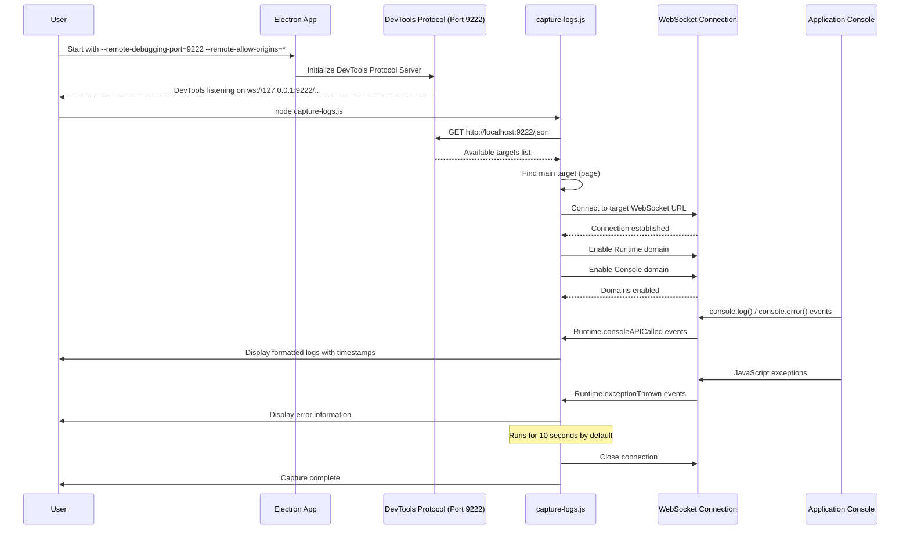

# Remote Debugging Guide for Electron Applications

This guide explains how to set up and use remote debugging to capture console logs from Electron applications using the Chrome DevTools Protocol.

## Overview

Remote debugging allows you to capture console logs, network activity, and debug information from a running Electron application without opening the DevTools interface manually. This is particularly useful for automated monitoring, debugging production issues, or capturing logs programmatically.

## Architecture Sequence



## Prerequisites

- Node.js installed
- Electron application (in this case, MCP Studio)
- `ws` package for WebSocket communication

## Setup Instructions

### 1. Install Required Dependencies

```bash
npm install ws
```

### 2. Start Electron Application with Remote Debugging

To enable remote debugging, start your Electron application with the following flags:

```bash
npx electron --remote-debugging-port=9222 --remote-allow-origins=* .
```

**Flag Explanations:**
- `--remote-debugging-port=9222`: Opens the Chrome DevTools Protocol on port 9222
- `--remote-allow-origins=*`: Allows connections from any origin (required for WebSocket connections)

### 3. Verify Remote Debugging is Active

Once the application starts, you should see output similar to:
```
DevTools listening on ws://127.0.0.1:9222/devtools/browser/[unique-id]
```

You can also verify by visiting `http://localhost:9222` in a browser to see available debugging targets.

## Using the Log Capture Script

### Script Overview

The `capture-logs.js` script connects to the Chrome DevTools Protocol and captures console logs in real-time.

### How It Works

1. **Target Discovery**: Queries `http://localhost:9222/json` to find available debugging targets
2. **WebSocket Connection**: Connects to the main application target via WebSocket
3. **Protocol Activation**: Enables Runtime and Console domains to receive log events
4. **Log Capture**: Listens for console API calls and runtime exceptions
5. **Output**: Displays captured logs with timestamps and log levels

### Running the Script

```bash
node capture-logs.js
```

### Sample Output

```
Fetching available targets...
Available targets:
0: MCP Studio - page - file:///Users/amr/src/mcp-studio/index.html

Connecting to target: MCP Studio
WebSocket URL: ws://localhost:9222/devtools/page/A8DD59232156302E237F25AAAC6AC670
Connected to DevTools Protocol

[2025-05-30T19:46:05.768Z] LOG: [MARKETPLACE DEBUG] Appended item 218 to container
[2025-05-30T19:47:35.199Z] LOG: MCP Studio initialized successfully
[2025-05-30T19:47:35.204Z] WARNING: Electron Security Warning (Insecure Content-Security-Policy)
```

## Script Features

### Captured Log Types

- **Console Logs**: `console.log()`, `console.error()`, `console.warn()`, etc.
- **Runtime Exceptions**: JavaScript errors and exceptions
- **Timestamps**: All logs include precise timestamps
- **Log Levels**: Distinguishes between LOG, ERROR, WARNING, etc.

### Automatic Cleanup

The script runs for 10 seconds by default and then automatically closes the connection. You can modify the timeout in the script:

```javascript
setTimeout(() => {
    console.log('\nCapture complete. Closing connection...');
    ws.close();
    process.exit(0);
}, 10000); // Change this value to adjust capture duration
```

## Troubleshooting

### Common Issues

1. **Connection Refused**
   - Ensure Electron app is running with remote debugging enabled
   - Check that port 9222 is not blocked by firewall

2. **WebSocket Connection Failed**
   - Make sure `--remote-allow-origins=*` flag is included
   - Verify the WebSocket URL is correct

3. **No Logs Appearing**
   - Interact with the application to generate console output
   - Check that the correct target is selected

### Security Considerations

- The `--remote-allow-origins=*` flag allows connections from any origin
- Only use this in development environments
- For production debugging, specify specific allowed origins

## Advanced Usage

### Filtering Logs

You can modify the script to filter specific log types:

```javascript
if (message.method === 'Runtime.consoleAPICalled') {
    const { type, args, timestamp } = message.params;
    
    // Filter only errors
    if (type === 'error') {
        const time = new Date(timestamp).toISOString();
        const values = args.map(arg => arg.value || arg.description || '[object]').join(' ');
        console.log(`[${time}] ${type.toUpperCase()}: ${values}`);
    }
}
```

### Saving Logs to File

```javascript
const fs = require('fs');
const logFile = fs.createWriteStream('debug-logs.txt', { flags: 'a' });

// In the message handler:
logFile.write(`[${time}] ${type.toUpperCase()}: ${values}\n`);
```

### Network Monitoring

Enable Network domain to capture network requests:

```javascript
ws.send(JSON.stringify({
    id: 4,
    method: 'Network.enable'
}));
```

## Integration with Development Workflow

### Automated Testing

Use the capture script in automated tests to verify console output:

```bash
# Start app with debugging
npx electron --remote-debugging-port=9222 --remote-allow-origins=* . &

# Wait for app to start
sleep 3

# Capture logs
node capture-logs.js > test-logs.txt

# Analyze logs for errors
grep "ERROR" test-logs.txt
```

### Continuous Monitoring

For long-running monitoring, modify the script to run indefinitely and implement log rotation.

## Files Created

- `capture-logs.js`: Main log capture script
- `REMOTE_DEBUGGING_GUIDE.md`: This documentation

## Summary

This remote debugging setup provides a powerful way to monitor and debug Electron applications programmatically. It's particularly useful for:

- Development debugging
- Automated testing
- Production issue investigation
- Performance monitoring
- Integration testing

The combination of Chrome DevTools Protocol and WebSocket communication offers real-time access to application internals without requiring manual DevTools interaction.
