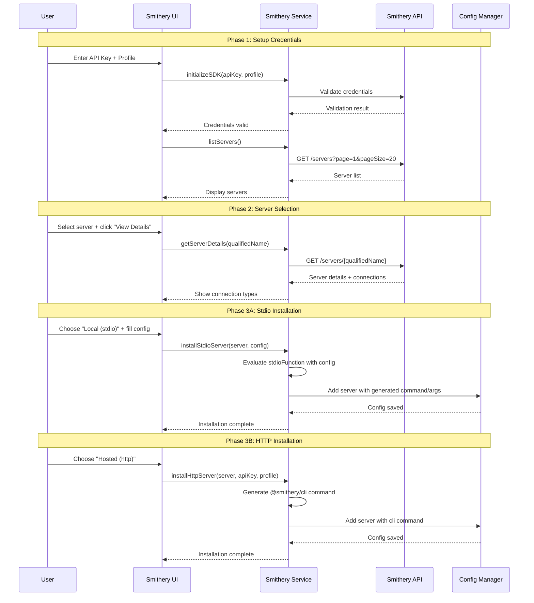

# Smithery Marketplace Integration Workflow

This document provides a comprehensive guide to integrating the Smithery marketplace in MCP Studio, enabling users to browse, search, and install MCP servers from the Smithery registry.

## Table of Contents

1. [Overview](#overview)
2. [API Endpoints](#api-endpoints)
3. [Core Components](#core-components)
4. [Connection Types](#connection-types)
5. [Workflow Sequence](#workflow-sequence)
6. [Implementation Plan](#implementation-plan)

## Overview

The Smithery integration allows users to:
- Browse and search MCP servers from the Smithery registry
- View detailed server information including tools and connection options
- Install servers with either stdio (local) or http (hosted) connections
- Automatically generate proper MCP configuration

### Key Differences from Composio
- **Global credentials**: Single API key + profile for entire marketplace
- **Two connection types**: stdio (local execution) and http (hosted service)
- **Different config format**: Uses `@smithery/cli` commands
- **No per-app authentication**: Credentials are marketplace-level

## API Endpoints

### List Servers
```
GET https://registry.smithery.ai/servers?page=1&pageSize=10
Authorization: Bearer {api_key}
```

**Response:**
```json
{
  "servers": [
    {
      "qualifiedName": "@wonderwhy-er/desktop-commander",
      "displayName": "Desktop Commander",
      "description": "Execute terminal commands and manage files...",
      "createdAt": "2025-01-10T06:39:31.942Z",
      "useCount": 836176,
      "homepage": "https://smithery.ai/server/@wonderwhy-er/desktop-commander"
    }
  ],
  "pagination": {
    "currentPage": 1,
    "pageSize": 10,
    "totalPages": 5,
    "totalCount": 50
  }
}
```

### Search Servers
```
GET https://registry.smithery.ai/servers?q=memory&page=1&pageSize=10
Authorization: Bearer {api_key}
```

### Get Server Details
```
GET https://registry.smithery.ai/servers/@jlia0/servers
Authorization: Bearer {api_key}
```

**Response:**
```json
{
  "qualifiedName": "@jlia0/servers",
  "displayName": "Knowledge Graph Memory Server",
  "remote": false,
  "iconUrl": "https://icons.duckduckgo.com/ip3/modelcontextprotocol.io.ico",
  "connections": [
    {
      "type": "stdio",
      "configSchema": {
        "type": "object",
        "properties": {
          "memoryFilePath": {
            "type": "string",
            "default": "memory.json",
            "description": "Path to the memory storage file"
          }
        }
      },
      "stdioFunction": "config => ({ command: 'npx', args: ['-y', '@modelcontextprotocol/server-memory'] })"
    },
    {
      "type": "http",
      "deploymentUrl": "https://server.smithery.ai/@jlia0/servers/mcp",
      "configSchema": {
        "type": "object",
        "properties": {
          "memoryFilePath": {
            "type": "string",
            "default": "memory.json",
            "description": "Path to the memory storage file"
          }
        }
      }
    }
  ],
  "tools": [
    {
      "name": "create_entities",
      "description": "Create multiple new entities in the knowledge graph",
      "inputSchema": { /* ... */ }
    }
  ]
}
```

## Core Components

### 1. Service Layer (`smithery-service.js`)

```javascript
// Core service functions
function initializeSDK(apiKey, profile) {
  // Store credentials for API calls
}

async function listServers(options = {}) {
  // GET /servers with pagination and search
}

async function getServerDetails(qualifiedName) {
  // GET /servers/{qualifiedName}
}

async function validateCredentials() {
  // Test API call to verify credentials
}
```

### 2. Connection Handler (`smithery-connector.js`)

```javascript
// Handle different connection types
async function handleStdioConnection(server, userConfig) {
  // Process stdio connection with user parameters
}

async function handleHttpConnection(server, apiKey, profile) {
  // Process http connection with global credentials
}

async function generateConfig(server, connectionType, params) {
  // Generate MCP configuration based on connection type
}
```

### 3. UI Components

Following the existing marketplace pattern:
- `js/features/smithery-marketplace/`
  - `index.js` - Main entry point
  - `data.js` - API data fetching
  - `ui.js` - UI rendering
  - `search.js` - Search functionality
  - `details.js` - Server details modal
  - `connector.js` - Installation logic

## Connection Types

### Stdio Connection (Local Execution)

**User Flow:**
1. User selects stdio connection
2. System shows configuration form based on `configSchema`
3. User fills in required parameters
4. System evaluates `stdioFunction` with user config
5. System generates MCP config with resulting command/args

**Example:**
```javascript
// Server provides:
"stdioFunction": "config => ({ command: 'npx', args: ['-y', '@modelcontextprotocol/server-memory'] })"

// User provides:
{ "memoryFilePath": "my-memory.json" }

// System generates:
{
  "command": "npx",
  "args": ["-y", "@modelcontextprotocol/server-memory"]
}
```

### HTTP Connection (Hosted Service)

**User Flow:**
1. User selects http connection
2. System shows deployment URL and explains hosted setup
3. User confirms they want to use hosted version
4. System generates MCP config using `@smithery/cli`

**Example:**
```javascript
// Server provides:
"deploymentUrl": "https://server.smithery.ai/@arjunkmrm/perplexity-search/mcp"

// System generates:
{
  "command": "npx",
  "args": [
    "-y",
    "@smithery/cli@latest",
    "run",
    "@arjunkmrm/perplexity-search",
    "--key",
    "12e10550-7b53-40d0-8ac3-xxx",
    "--profile",
    "legitimate-firefly-bSrBxD"
  ]
}
```

## Workflow Sequence



## Implementation Plan

### Modular Architecture (300-Line Limit Compliance)

**Core Requirements:**
- Default to HTTP servers (hosted via @smithery/cli)
- Fetch first 100 servers initially
- Real-time search functionality
- Reuse existing marketplace UI/caching
- Show tools in server details
- Each file strictly under 300 lines

### Phase 1: Micro-Service Layer
1. `smithery-service.js` (~50 lines) - API key storage, basic fetch wrapper
2. `smithery-api.js` (~80 lines) - listServers(), getServerDetails(), search()
3. `smithery-config.js` (~60 lines) - generateHttpConfig(), generateStdioConfig()
4. `smithery-connector.js` (~90 lines) - installServer(), connection handling

### Phase 2: UI Layer (Extending Existing)
1. Extend `js/features/marketplace/data.js` with Smithery adapter
2. Extend `js/features/marketplace/search.js` for Smithery API
3. Add tool display to `js/features/marketplace/details.js`
4. `smithery-ui.js` (~120 lines) - Smithery-specific rendering
5. `smithery-details.js` (~100 lines) - Details modal, installation flow

### Phase 3: Integration
1. Add Smithery tab to existing marketplace modal
2. Integrate with existing config manager
3. Reuse existing caching/pagination infrastructure

### File Structure (Micro-Modules)
```
js/features/smithery-marketplace/
├── index.js              # Entry point (~30 lines)
├── smithery-service.js   # API credentials (~50 lines)
├── smithery-api.js       # API calls (~80 lines)
├── smithery-config.js    # Config generation (~60 lines)
├── smithery-connector.js # Installation logic (~90 lines)
├── smithery-ui.js        # UI rendering (~120 lines)
└── smithery-details.js   # Details modal (~100 lines)
```

### Reuse Strategy
- **Extend** existing marketplace/data.js instead of duplicating
- **Import** shared utilities from marketplace/utils.js
- **Inherit** UI patterns from marketplace/ui.js
- **Leverage** existing modal/search/caching infrastructure

### Configuration Examples

**Stdio Server Config:**
```json
{
  "memory-server": {
    "command": "npx",
    "args": ["-y", "@modelcontextprotocol/server-memory"]
  }
}
```

**HTTP Server Config:**
```json
{
  "perplexity-search": {
    "command": "npx",
    "args": [
      "-y",
      "@smithery/cli@latest",
      "run",
      "@arjunkmrm/perplexity-search",
      "--key",
      "12e10550-7b53-40d0-8ac3-xxx",
      "--profile",
      "legitimate-firefly-bSrBxD"
    ]
  }
}
```

This integration will provide users with access to the extensive Smithery marketplace while maintaining consistency with the existing MCP Studio interface and patterns.
