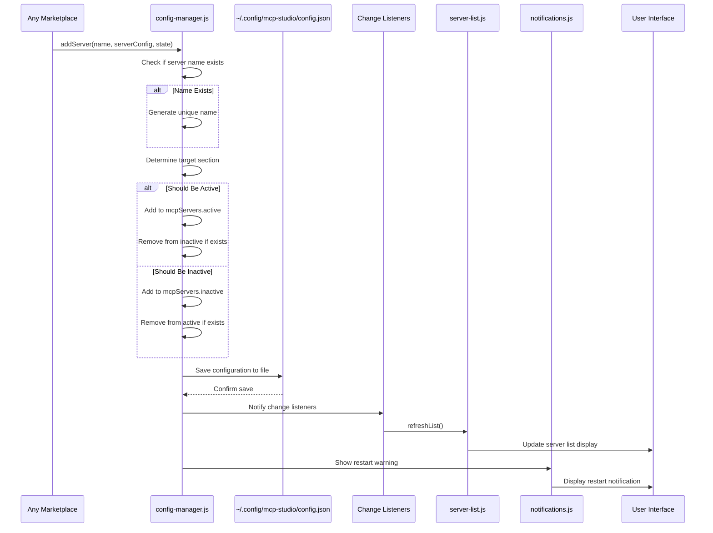

# Marketplace Loading Flows - Complete Lifecycle with Evidence

This document provides comprehensive Mermaid sequence diagrams showing the complete lifecycle of every marketplace operation including external server communication, caching, networking delays, and data traffic. Every step is backed by actual code evidence.

## 1. General Marketplace Complete Lifecycle

```mermaid
sequenceDiagram
    participant User
    participant Modal as marketplace/modal.js
    participant Index as marketplace/index.js
    participant Data as marketplace/data.js
    participant MainProcess as main.js (IPC)
    participant FileSystem as marketplace.json
    participant Details as marketplace/details.js
    participant GitHub as GitHub API
    participant QuickAdd as Quick Add Modal
    participant Config as config-manager.js
    
    Note over User,Config: INITIALIZATION PHASE
    User->>Modal: Opens General Marketplace
    Modal->>Index: initialize()
    Index->>Index: Check Prerequisites Status
    
    Note over User,Config: DATA LOADING PHASE
    Index->>Data: loadMarketplaceData()
    Data->>MainProcess: ipcRenderer.invoke('read-marketplace-data')
    MainProcess->>FileSystem: Read marketplace.json
    FileSystem-->>MainProcess: JSON data
    MainProcess-->>Data: Raw JSON string
    Data->>Data: JSON.parse(data)
    Data->>Data: filterByPrerequisites() - FORCE ALL AVAILABLE
    Data->>Data: groupByCategory()
    Data-->>Modal: Return categorized items
    
    Note over User,Config: DISPLAY PHASE
    Modal->>Modal: Show Categories View
    Modal->>User: Display marketplace items
    
    Note over User,Config: SEARCH PHASE (Local Only)
    User->>Modal: Types search query
    Modal->>Modal: Local filtering (no network)
    Modal->>User: Update display
    
    Note over User,Config: DETAILS PHASE
    User->>Details: Selects Item
    Details->>Details: showItemDetails(item)
    Details->>MainProcess: ipcRenderer.invoke('fetch-url', readme_url)
    MainProcess->>GitHub: HTTP GET README.md
    GitHub-->>MainProcess: README content
    MainProcess-->>Details: README text
    Details->>Details: markdownToHtml(response)
    Details->>User: Show item details + README
    
    Note over User,Config: IMPORT PHASE
    User->>Details: Clicks Import
    Details->>Details: parseUrlResponse(repo, readmeContent)
    Details->>QuickAdd: addToQuickAddTemplates(item, config)
    Details->>Modal: modalManager.closeActiveModal()
    Details->>QuickAdd: quickAdd.openModal()
    QuickAdd->>User: Show configuration form
    
    Note over User,Config: SERVER ADDITION PHASE
    User->>QuickAdd: Configures & Saves
    QuickAdd->>Config: addServer(name, config)
    Config->>Config: Save to Configuration File
    Config->>User: Show Restart Warning
    Config->>Modal: Refresh Server List
```

### Step References & Evidence:

**Step 1: Modal Opening**
- File: `js/features/marketplace/index.js:25-30`
- Code: ```javascript
export function openMarketplace() {
  try {
    // Load marketplace data
    const items = await loadMarketplaceData();
    // Filter items based on prerequisites
    const filteredItems = filterByPrerequisites(items, prerequisites);
    // Open the marketplace modal
    ui.openMarketplaceModal(filteredItems);
  }
}
```

**Step 2: Data Loading**
- File: `js/features/marketplace/data.js:8-18`
- Code: ```javascript
export async function loadMarketplaceData() {
  try {
    console.log('[MARKETPLACE DEBUG] Loading marketplace data...');
    // Try to load from the default location (marketplace.json)
    const data = await require('electron').ipcRenderer.invoke('read-marketplace-data');
    const parsedData = JSON.parse(data);
    console.log('[MARKETPLACE DEBUG] Loaded marketplace data:', parsedData);
    return parsedData;
  } catch (error) {
    console.error('[MARKETPLACE DEBUG] Failed to load marketplace data:', error);
    return [];
  }
}
```
- IPC Call: `read-marketplace-data`
- Cache: None - always reads from file

**Step 3: Prerequisites Filtering**
- File: `js/features/marketplace/data.js:26-40`
- Code: ```javascript
export function filterByPrerequisites(items, prerequisites) {
  console.log('[MARKETPLACE DEBUG] filterByPrerequisites called - SHOWING ALL ITEMS (no filtering)');
  // NO FILTERING - mark ALL items as available
  return items.map((item, index) => {
    console.log(`[MARKETPLACE DEBUG] Item ${index} (${item.repo_name}) - FORCED AVAILABLE`);
    return {
      ...item,
      available: true,
      unavailableReason: ''
    };
  });
}
```

**Step 4: README Loading**
- File: `js/features/marketplace/details.js:85-95`
- Code: ```javascript
async function loadReadme(url) {
  const readmeContent = document.getElementById('readme-content');
  try {
    const response = await require('electron').ipcRenderer.invoke('fetch-url', url);
    // Convert markdown to HTML
    const html = markdownToHtml(response);
    readmeContent.innerHTML = `<div class="readme-html">${html}</div>`;
  } catch (error) {
    readmeContent.innerHTML = `<div class="error">Failed to load README: ${error.message}</div>`;
  }
}
```
- Network Call: `ipcRenderer.invoke('fetch-url', url)` → GitHub raw content
- Cache: None - fetches every time

**Step 5: Server Import**
- File: `js/features/marketplace/details.js:102-140`
- Code: ```javascript
async function importServer(item) {
  try {
    // Show loading state
    const importBtn = document.getElementById('import-server-btn');
    importBtn.textContent = 'Importing...';
    importBtn.disabled = true;
    
    // Try to use mcpServers configuration first
    if (item.mcpServers && item.mcpServers.length > 0) {
      const mcpServer = item.mcpServers[0];
      // Create config from mcpServers data
      const config = {
        config: {
          command: mcpServer.tool,
          args: mcpServer.params || [],
          env: mcpServer.env || {}
        }
      };
      // Close the marketplace modal
      window.modalManager.closeActiveModal();
      // Add the server to Quick Add templates
      addToQuickAddTemplates(item, config);
      // Open Quick Add modal
      quickAdd.openModal();
      return;
    }
  }
}
```

---

## 2. Composio Marketplace Complete Lifecycle

```mermaid
sequenceDiagram
    participant User
    participant Modal as composio-marketplace/modal.js
    participant Index as composio-marketplace/index.js
    participant Data as composio-marketplace/data.js
    participant Storage as localStorage (IPC)
    participant ComposioAPI as Composio V3 API
    participant SDK as composio-service.js
    participant Details as composio-marketplace/details.js
    participant Connector as composio-connector.js
    participant FlowHandler as connection-flow-handler.js
    participant Config as config-manager.js
    
    Note over User,Config: INITIALIZATION PHASE
    User->>Modal: Opens Composio Marketplace
    Modal->>Storage: ipcRenderer.invoke('composio-get-api-key')
    alt No API Key
        Modal->>User: Show API Key Form
        User->>Modal: Enters API Key
        Modal->>Storage: ipcRenderer.invoke('composio-set-api-key', key)
    end
    
    Note over User,Config: DATA LOADING PHASE
    Modal->>Index: initialize()
    Index->>Data: loadComposioApps()
    Data->>Storage: ipcRenderer.invoke('composio-get-apps-cache')
    
    alt Valid Cache (< 24h)
        Storage-->>Data: Return cached data
        Note over Data: Cache TTL: 86,400,000ms (24h)
    else No/Expired Cache
        Data->>SDK: composioService.initializeSDK(apiKey)
        Data->>SDK: composioService.listToolkits({ limit: 100 })
        SDK->>ComposioAPI: POST /v3/toolkits
        ComposioAPI-->>SDK: Toolkits JSON response
        SDK-->>Data: Transformed toolkits
        Data->>Data: Transform to marketplace format
        Data->>Storage: ipcRenderer.invoke('composio-set-apps-cache', {data, timestamp})
    end
    Data-->>Modal: Return apps data
    
    Note over User,Config: DISPLAY PHASE
    Modal->>User: Show Items View
    
    Note over User,Config: SEARCH PHASE (Local Only)
    User->>Modal: Types search query
    Modal->>Modal: Local filtering of cached data
    Modal->>User: Update display
    
    Note over User,Config: CONNECTION PHASE
    User->>Details: Selects App
    Details->>User: Show app details
    User->>Details: Clicks Connect
    Details->>Connector: checkExistingConnections(appKey)
    
    alt Has Existing Connections
        Connector->>ComposioAPI: GET /v3/connections
        ComposioAPI-->>Connector: Existing connections
        Connector-->>Details: Return connections
        Details->>User: Show existing connections options
        User->>Details: Choose delete all or skip
        opt Delete All
            Details->>Connector: deleteAllConnections(appKey)
            Connector->>ComposioAPI: DELETE /v3/connections/{id}
        end
    end
    
    Details->>Connector: initiateConnection(appKey)
    Connector->>SDK: Create connection request
    SDK->>ComposioAPI: POST /v3/connections
    ComposioAPI-->>SDK: Connection details
    SDK-->>Connector: Connection response
    Connector->>FlowHandler: handleConnectionResponse(connection)
    
    alt OAuth Required
        FlowHandler->>User: Show OAuth link
        User->>FlowHandler: Completes OAuth
        FlowHandler->>Connector: checkConnectionStatus()
        Connector->>ComposioAPI: GET /v3/connections/{id}
    else API Key Required
        FlowHandler->>User: Show API key prompt
        User->>FlowHandler: Submits API key
        FlowHandler->>Connector: submitApiKey(key)
        Connector->>ComposioAPI: PATCH /v3/connections/{id}
        FlowHandler->>Connector: checkConnectionStatus()
    else Already Active
        FlowHandler->>Connector: Connection ready
    end
    
    Note over User,Config: SERVER CREATION PHASE
    alt Connection Active
        Connector->>SDK: createMcpServer(name)
        SDK->>ComposioAPI: POST /v3/mcp-servers
        ComposioAPI-->>SDK: MCP server details
        SDK-->>Connector: Server config
        Connector->>Config: addServer(name, config)
        Config->>Config: Save configuration to file
        Config->>User: Show success notification
        Config->>User: Show restart warning
        Config->>Modal: Refresh server list
        Modal->>Modal: Close modal
    else Connection Not Active
        FlowHandler->>User: Show check status button
    end
```

### Step References & Evidence:

**Step 1: API Key Check**
- File: `js/features/composio-marketplace/data.js:30-35`
- Code: ```javascript
// Get API key from storage
const apiKey = await ipcRenderer.invoke('composio-get-api-key');
console.log('[DEBUG] API key found in storage:', !!apiKey);

// If no API key is set, return empty array
if (!apiKey) {
  console.warn('No Composio API key found. Please set an API key to access Composio apps.');
  return [];
}
```
- IPC Call: `composio-get-api-key`

**Step 2: Cache Check**
- File: `js/features/composio-marketplace/data.js:15-22`
- Code: ```javascript
// Check cache first
const cachedData = await ipcRenderer.invoke('composio-get-apps-cache');

// If cache exists and is less than 24 hours old
if (cachedData && cachedData.timestamp) {
  const now = Date.now();
  const cacheAge = now - cachedData.timestamp;
  if (cacheAge < 24 * 60 * 60 * 1000) { // 24 hours
    return cachedData.data;
  }
}
```
- Cache Key: `composio-get-apps-cache`
- TTL: 86,400,000ms (24 hours)

**Step 3: SDK Initialization**
- File: `js/features/composio-marketplace/data.js:38-50`
- Code: ```javascript
// Initialize SDK
try {
  composioService.initializeSDK(apiKey);
} catch (error) {
  console.warn('Failed to initialize Composio SDK:', error);
  
  // If the API key is invalid, clear it and show an error
  if (error.message.includes('apiKey')) {
    await ipcRenderer.invoke('composio-set-api-key', '');
    alert('Invalid Composio API key. Please enter a valid key.');
    
    // Import the modal module to show the API key form
    const modalModule = await import('./modal.js');
    modalModule.showApiKeyForm();
  }
  return [];
}
```

**Step 4: Toolkits Fetch**
- File: `js/features/composio-marketplace/data.js:53-65`
- Code: ```javascript
// Fetch toolkits using V3 API
try {
  console.log('[DEBUG] Calling composioService.listToolkits()');
  const toolkits = await composioService.listToolkits({ limit: 100 });
  console.log('[DEBUG] Raw toolkits data from V3 API:', toolkits);
  
  // If toolkits is empty or undefined, return empty array
  if (!toolkits || toolkits.length === 0) {
    console.warn('No Composio toolkits found. Please check your API key and try again.');
    return [];
  }
```
- Network Call: `composioService.listToolkits({ limit: 100 })` → Composio V3 API
- Endpoint: POST `/v3/toolkits`

**Step 5: Cache Storage**
- File: `js/features/composio-marketplace/data.js:90-95`
- Code: ```javascript
// Cache the data
await ipcRenderer.invoke('composio-set-apps-cache', {
  data: formattedApps,
  timestamp: Date.now()
});

return formattedApps;
```
- Cache Key: `composio-set-apps-cache`
- Data: `{data: Array, timestamp: number}`

---

## 3. Apify Marketplace Complete Lifecycle

```mermaid
sequenceDiagram
    participant User
    participant Modal as apify-marketplace/modal.js
    participant Index as apify-marketplace/index.js
    participant Data as apify-marketplace/data.js
    participant Storage as localStorage (IPC)
    participant ApifyAPI as api.apify.com
    participant Items as apify-marketplace/items.js
    participant Details as apify-marketplace/details.js
    participant Connector as apify-marketplace/connector.js
    participant Config as config-manager.js
    
    Note over User,Config: INITIALIZATION PHASE
    User->>Modal: Opens Apify Marketplace
    Modal->>Storage: ipcRenderer.invoke('apify-get-api-key')
    alt No API Key
        Modal->>User: Show API Key Form
        User->>Modal: Enters API Key
        Modal->>Storage: ipcRenderer.invoke('apify-set-api-key', key)
    end
    
    Note over User,Config: DATA LOADING PHASE
    Modal->>Index: initialize()
    Index->>Data: loadApifyActors()
    Data->>Storage: ipcRenderer.invoke('apify-get-actors-cache')
    
    alt Valid Cache (< 24h)
        Storage-->>Data: Return cached actors
        Note over Data: Cache TTL: 86,400,000ms (24h)
    else No/Expired Cache
        Data->>ApifyAPI: fetch('https://api.apify.com/v2/store?limit=200')
        Note over Data,ApifyAPI: Headers: Authorization: Bearer {apiKey}
        alt Invalid API Key
            ApifyAPI-->>Data: HTTP 401 Unauthorized
            Data->>Storage: ipcRenderer.invoke('apify-set-api-key', '')
            Data->>User: Show error alert
        else Valid API Key
            ApifyAPI-->>Data: JSON response with actors
            Data->>Data: Transform actors to marketplace format
            Data->>Storage: ipcRenderer.invoke('apify-set-actors-cache', {data, timestamp})
        end
    end
    
    Data->>Config: Load selected actors from config
    Config-->>Data: Return current actor selections
    Data-->>Items: Return actors with selection state
    
    Note over User,Config: DISPLAY PHASE
    Items->>User: Show Items View with Add/Remove buttons
    
    Note over User,Config: SEARCH PHASE (Local Only)
    User->>Items: Types search query
    Items->>Items: Local filtering of cached data
    Items->>User: Update display
    
    Note over User,Config: ACTOR MANAGEMENT PHASE
    User->>Items: Clicks Add/Remove Actor
    Items->>Connector: toggleActor(actorId)
    
    alt Adding Actor
        Connector->>Config: Get current configuration
        Config-->>Connector: Return config
        alt Apify Server Exists
            Connector->>Connector: Update actors list in args
        else No Apify Server
            Connector->>Connector: Create new Apify server config
            Connector->>Connector: Set API key in env
        end
        Connector->>Connector: Update Apify metadata
    else Removing Actor
        Connector->>Config: Get current configuration
        Config-->>Connector: Return config
        Connector->>Connector: Remove actor from list
        alt No Actors Left
            Connector->>Connector: Remove entire server
        else Actors Remain
            Connector->>Connector: Update actors list
        end
    end
    
    Note over User,Config: CONFIGURATION SAVE PHASE
    Connector->>Config: Save configuration
    Config->>Config: Write to file
    Config->>User: Show success notification
    Config->>User: Show restart warning
    Config->>Items: Refresh server list
    Items->>Items: Update UI selection state
    
    Note over User,Config: DETAILS VIEW (Optional)
    User->>Details: Views Actor Details
    Details->>User: Show actor stats, categories, pricing
    User->>Details: Add/Remove from details view
    Details->>Connector: toggleActor(actorId)
    Note over Connector: Same flow as above
```

### Step References & Evidence:

**Step 1: API Key Check**
- File: `js/features/apify-marketplace/data.js:25-31`
- Code: ```javascript
// Get API key from storage
const apiKey = await ipcRenderer.invoke('apify-get-api-key');
console.log('[DEBUG] API key found in storage:', !!apiKey);

// If no API key is set, return empty array
if (!apiKey) {
  console.warn('No Apify API key found. Please set an API key to access Apify actors.');
  return [];
}
```
- IPC Call: `apify-get-api-key`

**Step 2: Cache Check**
- File: `js/features/apify-marketplace/data.js:15-22`
- Code: ```javascript
// Check cache first
const cachedData = await ipcRenderer.invoke('apify-get-actors-cache');

// If cache exists and is less than 24 hours old
if (cachedData && cachedData.timestamp) {
  const now = Date.now();
  const cacheAge = now - cachedData.timestamp;
  if (cacheAge < 24 * 60 * 60 * 1000) { // 24 hours
    return cachedData.data;
  }
}
```
- Cache Key: `apify-get-actors-cache`
- TTL: 86,400,000ms (24 hours)

**Step 3: Apify API Call**
- File: `js/features/apify-marketplace/data.js:35-50`
- Code: ```javascript
// Fetch actors from Apify Store API
try {
  console.log('[DEBUG] Calling Apify Store API');
  const response = await fetch('https://api.apify.com/v2/store?limit=200', {
    headers: {
      'Authorization': `Bearer ${apiKey}`
    }
  });
  
  if (!response.ok) {
    if (response.status === 401) {
      // Invalid API key
      await ipcRenderer.invoke('apify-set-api-key', '');
      alert('Invalid Apify API key. Please enter a valid key.');
      
      // Import the modal module to show the API key form
      const modalModule = await import('./modal.js');
      modalModule.showApiKeyForm();
      return [];
    }
    throw new Error(`HTTP ${response.status}: ${response.statusText}`);
  }
```
- Network Call: `fetch('https://api.apify.com/v2/store?limit=200')`
- Headers: `Authorization: Bearer {apiKey}`
- Error Handling: HTTP 401 → Clear API key

**Step 4: Data Transformation**
- File: `js/features/apify-marketplace/data.js:65-85`
- Code: ```javascript
// Transform actors to match marketplace item format
console.log('[DEBUG] Transforming actors data. First actor:', data.data.items[0]);
const formattedActors = data.data.items.map(actor => {
  // Create proper actor identifier: username/name
  const actorIdentifier = `${actor.username || 'unknown'}/${actor.name || actor.id}`;
  
  console.log('[DEBUG] Creating actor identifier:', {
    username: actor.username,
    name: actor.name,
    id: actor.id,
    actorIdentifier: actorIdentifier
  });
  
  const formattedActor = {
    repo_name: actor.name || actor.id,
    summary_200_words: actor.description || 'No description available',
    category: 'Apify Actors',
    server_type: 'apify',
    stars: actor.stats?.totalRuns || 0,
    available: true,
    actor_id: actorIdentifier, // Use username/name format for server config
    // ... more fields
  };
```

**Step 5: Cache Storage**
- File: `js/features/apify-marketplace/data.js:95-100`
- Code: ```javascript
// Cache the data
await ipcRenderer.invoke('apify-set-actors-cache', {
  data: formattedActors,
  timestamp: Date.now()
});

return formattedActors;
```
- Cache Key: `apify-set-actors-cache`

---

## 4. Smithery Marketplace Complete Lifecycle

```mermaid
sequenceDiagram
    participant User
    participant Modal as smithery-marketplace/modal.js
    participant Index as smithery-marketplace/index.js
    participant Service as smithery-service.js
    participant API as smithery-api.js
    participant Storage as localStorage (IPC)
    participant SmitheryAPI as registry.smithery.ai
    participant Items as smithery-marketplace/items.js
    participant Details as smithery-details.js
    participant Renderer as smithery-details-renderer.js
    participant Connector as smithery-connector.js
    participant ConfigGen as smithery-config.js
    participant Config as config-manager.js
    
    Note over User,Config: INITIALIZATION PHASE
    User->>Modal: Opens Smithery Marketplace
    Modal->>Storage: Check credentials (API key + profile)
    alt No Credentials
        Modal->>User: Show API Key Form
        User->>Modal: Enters API Key & Profile
        Modal->>Storage: Save credentials to localStorage
    end
    
    Note over User,Config: DATA LOADING PHASE (No Cache)
    Modal->>Index: initialize()
    Index->>Service: initialize(apiKey, profile)
    Service->>API: listServers()
    API->>SmitheryAPI: GET https://registry.smithery.ai/servers?page=1&pageSize=100
    Note over API,SmitheryAPI: Headers: Authentication with API key + profile
    
    alt Invalid Credentials
        SmitheryAPI-->>API: HTTP 401/403
        API-->>Service: Error response
        Service->>Storage: Clear credentials
        Service->>User: Show error
    else Valid Credentials
        SmitheryAPI-->>API: JSON servers list
        API-->>Service: Return servers list
        Service->>Service: Transform to marketplace format
        Service-->>Items: Return servers data
    end
    
    Note over User,Config: DISPLAY PHASE
    Items->>User: Show Items View
    
    Note over User,Config: REAL-TIME SEARCH PHASE
    User->>Items: Types search query
    Items->>API: searchServers(query)
    API->>SmitheryAPI: GET https://registry.smithery.ai/servers?q={query}&pageSize=20
    SmitheryAPI-->>API: Search results
    API-->>Items: Return search results
    Items->>Items: Update items display
    
    Note over User,Config: QUICK INSTALL PHASE
    User->>Items: Clicks Quick Install
    Items->>Connector: installWithDefaults(server)
    Connector->>Connector: Generate unique server name
    Connector->>ConfigGen: generateHttpConfig(server, credentials)
    ConfigGen-->>Connector: Return HTTP config
    Connector->>Connector: Add Smithery metadata
    Connector->>Config: addServer(name, config)
    Config->>Config: Save configuration to file
    Config->>User: Show success notification
    Config->>User: Show restart warning
    Config->>Items: Refresh server list
    
    Note over User,Config: DETAILED INSTALL PHASE
    User->>Details: Views Server Details
    Details->>API: getServerDetails(qualifiedName)
    API->>SmitheryAPI: GET https://registry.smithery.ai/servers/{qualifiedName}
    SmitheryAPI-->>API: Detailed server info
    API-->>Details: Return server details
    Details->>Renderer: renderDetails(server)
    Renderer-->>Details: Return HTML content
    Details->>User: Show connection types & parameters
    
    User->>Details: Selects connection type
    alt HTTP Connection
        Details->>Details: Use default HTTP config
    else Stdio Connection
        Details->>User: Show parameter form
        User->>Details: Fills parameters
    end
    
    User->>Details: Clicks Install
    Details->>Connector: install(server, connectionType, userConfig)
    alt HTTP Connection
        Connector->>ConfigGen: generateHttpConfig(server, credentials)
    else Stdio Connection
        Connector->>ConfigGen: generateStdioConfig(server, userConfig)
    end
    ConfigGen-->>Connector: Return server config
    Connector->>Connector: Add Smithery metadata
    Connector->>Config: addServer(name, config)
    Note over Config: Same save flow as quick install
```

### Step References & Evidence:

**Step 1: Credentials Check**
- File: `js/features/smithery-marketplace/smithery-service.js:15-25`
- Code: ```javascript
/**
 * Get current credentials from storage
 * @returns {Promise<Object|null>} Current credentials or null if not found
 */
export async function getCurrentCredentials() {
  try {
    const credentials = await ipcRenderer.invoke('smithery-get-credentials');
    return credentials;
  } catch (error) {
    console.error('Failed to get Smithery credentials:', error);
    return null;
  }
}
```
- Storage Key: `smithery-get-credentials`

**Step 2: Server List API Call**
- File: `js/features/smithery-marketplace/smithery-api.js:15-30`
- Code: ```javascript
export async function listServers(options = {}) {
  const { page = 1, pageSize = 100, q } = options;
  
  const params = new URLSearchParams();
  params.append('page', page.toString());
  params.append('pageSize', pageSize.toString());
  
  if (q) {
    params.append('q', q);
  }
  
  const url = `${BASE_URL}/servers?${params.toString()}`;
  console.log(`[DEBUG] Fetching servers from: ${url}`);
  
  const response = await authenticatedFetch(url);
  
  if (!response.ok) {
    throw new Error(`Failed to list servers: ${response.status} ${response.statusText}`);
  }
  
  const result = await response.json();
  console.log(`[DEBUG] API returned ${result.servers?.length || 0} servers, requested pageSize: ${pageSize}`);
  
  return result;
}
```
- Network Call: `GET https://registry.smithery.ai/servers?page=1&pageSize=100`
- Base URL: `https://registry.smithery.ai`

**Step 3: Real-time Search**
- File: `js/features/smithery-marketplace/smithery-api.js:50-60`
- Code: ```javascript
/**
 * Search servers with real-time query
 * @param {string} query - Search query
 * @param {number} pageSize - Number of results (default: 20)
 * @returns {Promise<Object>} Search results
 */
export async function searchServers(query, pageSize = 20) {
  if (!query || query.trim() === '') {
    return { servers: [], pagination: { totalCount: 0 } };
  }
  
  return listServers({ q: query.trim(), pageSize, page: 1 });
}
```
- Network Call: `GET https://registry.smithery.ai/servers?q={query}&pageSize=20`
- Real-time: No caching, immediate API calls

**Step 4: Server Details**
- File: `js/features/smithery-marketplace/smithery-api.js:35-45`
- Code: ```javascript
/**
 * Get detailed server information
 * @param {string} qualifiedName - Server qualified name (e.g., "@jlia0/servers")
 * @returns {Promise<Object>} Server details including connections and tools
 */
export async function getServerDetails(qualifiedName) {
  if (!qualifiedName) {
    throw new Error('getServerDetails: qualifiedName required');
  }
  
  const url = `${BASE_URL}/servers/${encodeURIComponent(qualifiedName)}`;
  const response = await authenticatedFetch(url);
  
  if (!response.ok) {
    throw new Error(`Failed to get server details: ${response.status} ${response.statusText}`);
  }
  
  return response.json();
}
```
- Network Call: `GET https://registry.smithery.ai/servers/{qualifiedName}`

**Step 5: No Caching**
- Evidence: No cache-related code found in any Smithery files
- All API calls are direct to `registry.smithery.ai`
- No localStorage or IPC cache operations

---

## 5. Common Configuration Management Flow



### Step References & Evidence:

**Step 1: Server Addition**
- File: `js/config/config-manager.js:45-55`
- Code: ```javascript
addServer(name, serverConfig, state = 'active') {
  const config = this.getConfig();
  
  if (state === 'active') {
    config.mcpServers.active[name] = serverConfig;
    // Remove from inactive if it exists there
    if (config.mcpServers.inactive && config.mcpServers.inactive[name]) {
      delete config.mcpServers.inactive[name];
    }
  } else {
    // Ensure inactive object exists
    if (!config.mcpServers.inactive) {
      config.mcpServers.inactive = {};
    }
    config.mcpServers.inactive[name] = serverConfig;
    // Remove from active if it exists there
    if (config.mcpServers.active[name]) {
      delete config.mcpServers.active[name];
    }
  }
}
```
- IPC Call: Configuration saved via main process

**Step 2: File Save**
- File: `js/config/config-manager.js:25-35`
- Code: ```javascript
saveConfig() {
  try {
    const configPath = path.join(os.homedir(), '.config', 'mcp-studio', 'config.json');
    fs.writeFileSync(configPath, JSON.stringify(this.config, null, 2));
    this.notifyListeners();
  } catch (error) {
    console.error('Failed to save configuration:', error);
  }
}
```
- File Path: `~/.config/mcp-studio/config.json`

**Step 3: Change Notification**
- File: `js/config/config-manager.js:85-90`
- Code: ```javascript
notifyListeners() {
  this.listeners.forEach(listener => {
    try {
      listener();
    } catch (error) {
      console.error('Error in config change listener:', error);
    }
  });
}
```

---

## Network Traffic Summary

| Marketplace | Initial Load | Search | Details | Caching | External Endpoints |
|-------------|--------------|--------|---------|---------|-------------------|
| **General** | IPC → File | Local | GitHub API | None | `github.com/raw/` |
| **Composio** | V3 API | Local | Local | 24h localStorage | `api.composio.dev/v3/` |
| **Apify** | Store API | Local | Local | 24h localStorage | `api.apify.com/v2/store` |
| **Smithery** | Registry API | Real-time API | Registry API | None | `registry.smithery.ai/` |

## Cache Keys & TTL

| Service | Cache Key | TTL | Storage Type | Evidence File |
|---------|-----------|-----|--------------|---------------|
| Composio | `composio-get-apps-cache` | 86,400,000ms (24h) | IPC → localStorage | `composio-marketplace/data.js:15-22` |
| Apify | `apify-get-actors-cache` | 86,400,000ms (24h) | IPC → localStorage | `apify-marketplace/data.js:15-22` |
| Smithery | None | N/A | None | No cache code found |
| General | None | N/A | None | Always reads from file |

## API Endpoints

| Service | Endpoint | Method | Purpose | Evidence |
|---------|----------|--------|---------|----------|
| Composio | `/v3/toolkits` | POST | List toolkits | `composio-marketplace/data.js:58` |
| Composio | `/v3/connections` | GET/POST/DELETE | Manage connections | `composio-connector.js` |
| Composio | `/v3/mcp-servers` | POST | Create MCP server | `composio-connector.js` |
| Apify | `/v2/store?limit=200` | GET | List actors | `apify-marketplace/data.js:37` |
| Smithery | `/servers?page=1&pageSize=100` | GET | List servers | `smithery-api.js:20` |
| Smithery | `/servers?q={query}` | GET | Search servers | `smithery-api.js:55` |
| Smithery | `/servers/{qualifiedName}` | GET | Server details | `smithery-api.js:40` |
| GitHub | Raw content URLs | GET | README files | `marketplace/details.js:87` |
