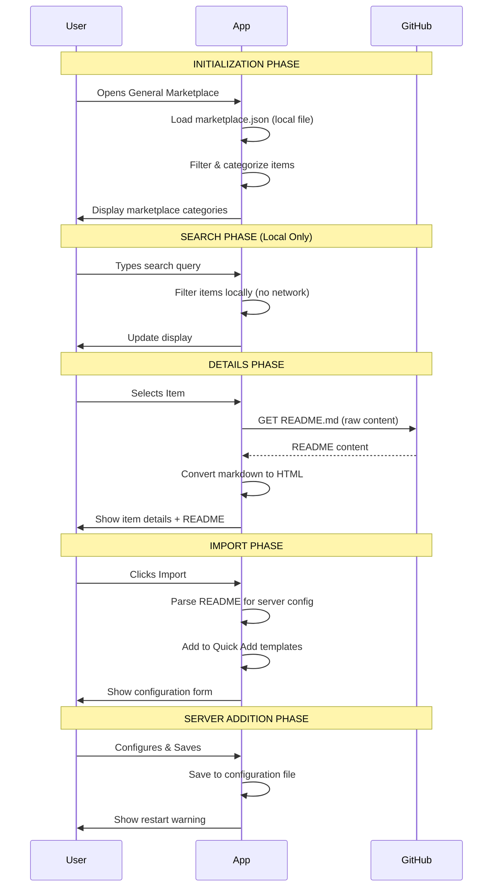
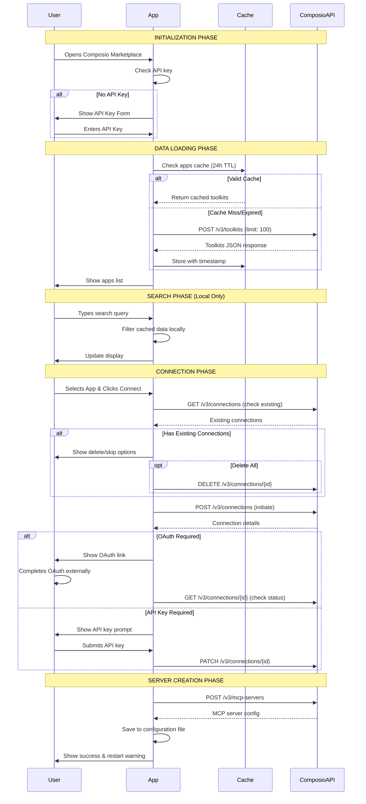
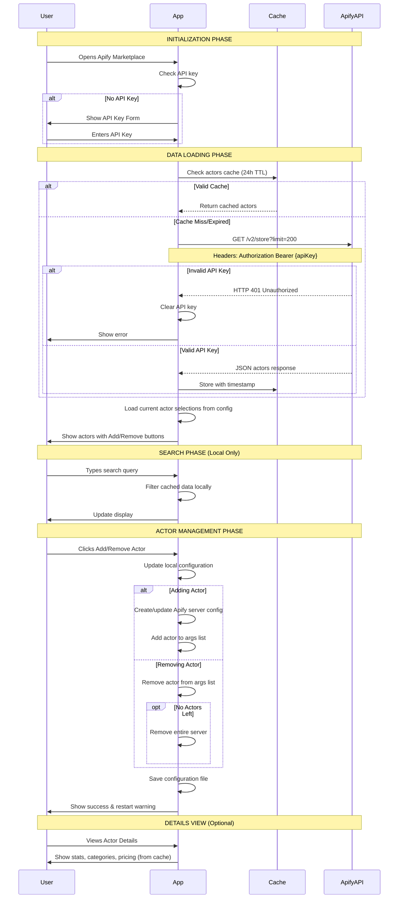
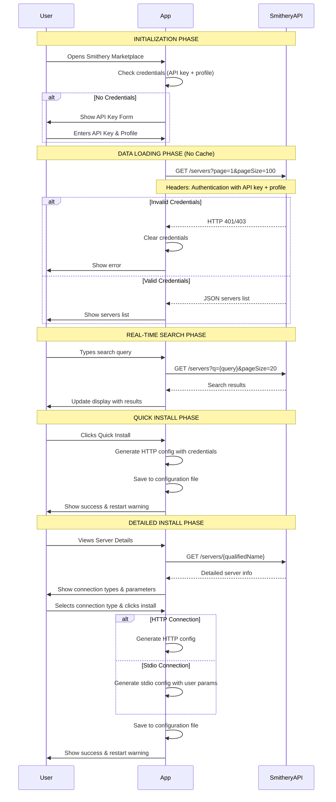
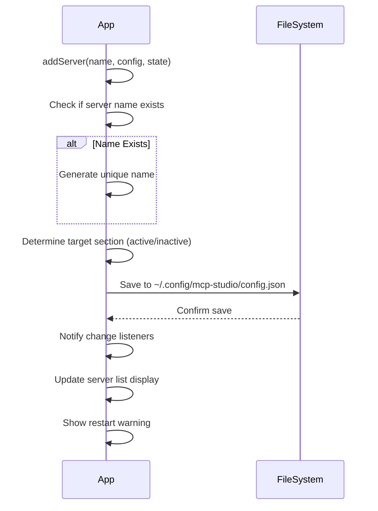

# Marketplace Loading Flows - Complete Lifecycle with Evidence

This document provides comprehensive Mermaid sequence diagrams showing the complete lifecycle of every marketplace operation including external server communication, caching, networking delays, and data traffic. Every step is backed by actual code evidence.

## 1. General Marketplace Complete Lifecycle

### Step References & Evidence:

**Data Loading (No Cache)**
- File: `js/features/marketplace/data.js:8-18`
- Network: IPC call to read local `marketplace.json` file
- Cache: None - always reads from file

**README Fetching**
- File: `js/features/marketplace/details.js:85-95`
- Network: `ipcRenderer.invoke('fetch-url', url)` → GitHub raw content
- Cache: None - fetches every time

---

## 2. Composio Marketplace Complete Lifecycle

### Step References & Evidence:

**Cache Check**
- File: `js/features/composio-marketplace/data.js:15-22`
- Cache Key: `composio-get-apps-cache`
- TTL: 86,400,000ms (24 hours)

**API Calls**
- File: `js/features/composio-marketplace/data.js:53-65`
- Network: `composioService.listToolkits({ limit: 100 })` → POST `/v3/toolkits`
- Network: Connection management via `/v3/connections` endpoints
- Network: MCP server creation via POST `/v3/mcp-servers`

---

## 3. Apify Marketplace Complete Lifecycle

### Step References & Evidence:

**Cache Check**
- File: `js/features/apify-marketplace/data.js:15-22`
- Cache Key: `apify-get-actors-cache`
- TTL: 86,400,000ms (24 hours)

**API Call**
- File: `js/features/apify-marketplace/data.js:35-50`
- Network: `fetch('https://api.apify.com/v2/store?limit=200')`
- Headers: `Authorization: Bearer {apiKey}`
- Error Handling: HTTP 401 → Clear API key

---

## 4. Smithery Marketplace Complete Lifecycle

### Step References & Evidence:

**No Caching**
- Evidence: No cache-related code found in Smithery files
- All API calls are direct to `registry.smithery.ai`

**API Calls**
- File: `js/features/smithery-marketplace/smithery-api.js:15-30`
- Network: `GET https://registry.smithery.ai/servers?page=1&pageSize=100`
- Network: `GET https://registry.smithery.ai/servers?q={query}&pageSize=20` (real-time search)
- Network: `GET https://registry.smithery.ai/servers/{qualifiedName}` (details)

---

## 5. Common Configuration Management Flow

### Step References & Evidence:

**Configuration Save**
- File: `js/config/config-manager.js:25-35`
- File Path: `~/.config/mcp-studio/config.json`

---

## Network Traffic Summary

| Marketplace | Initial Load | Search | Details | Caching | External Endpoints |
|-------------|--------------|--------|---------|---------|-------------------|
| **General** | Local File | Local | GitHub API | None | `github.com/raw/` |
| **Composio** | V3 API | Local | Local | 24h Cache | `api.composio.dev/v3/` |
| **Apify** | Store API | Local | Local | 24h Cache | `api.apify.com/v2/store` |
| **Smithery** | Registry API | Real-time API | Registry API | None | `registry.smithery.ai/` |

## Cache Keys & TTL

| Service | Cache Key | TTL | Storage Type | Evidence File |
|---------|-----------|-----|--------------|---------------|
| Composio | `composio-get-apps-cache` | 86,400,000ms (24h) | localStorage | `composio-marketplace/data.js:15-22` |
| Apify | `apify-get-actors-cache` | 86,400,000ms (24h) | localStorage | `apify-marketplace/data.js:15-22` |
| Smithery | None | N/A | None | No cache code found |
| General | None | N/A | None | Always reads from file |

## API Endpoints

| Service | Endpoint | Method | Purpose | Evidence |
|---------|----------|--------|---------|----------|
| Composio | `/v3/toolkits` | POST | List toolkits | `composio-marketplace/data.js:58` |
| Composio | `/v3/connections` | GET/POST/DELETE | Manage connections | `composio-connector.js` |
| Composio | `/v3/mcp-servers` | POST | Create MCP server | `composio-connector.js` |
| Apify | `/v2/store?limit=200` | GET | List actors | `apify-marketplace/data.js:37` |
| Smithery | `/servers?page=1&pageSize=100` | GET | List servers | `smithery-api.js:20` |
| Smithery | `/servers?q={query}` | GET | Search servers | `smithery-api.js:55` |
| Smithery | `/servers/{qualifiedName}` | GET | Server details | `smithery-api.js:40` |
| GitHub | Raw content URLs | GET | README files | `marketplace/details.js:87` |
